Japan Xamarin User Group Conference #4 MvvmCross ハンズオン
---------

# 今日のお題

MvvmCross を使って YouTube 検索アプリを作ります。

* 検索フィールドにキーワードを入力すると、検索結果を一覧表示する。
* 検索結果にはサムネイルとタイトル、説明文を表示します。
* 検索結果をタップするとその動画にジャンプします。


# Step.1 プロジェクトの作成

Xamarin Studio でソリューションを作成します。

* プロジェクトの種類: C# ポータブルライブラリ
* プロジェクト名: YoutubeSearch.Core
* ソリューション名: YoutubeSearch

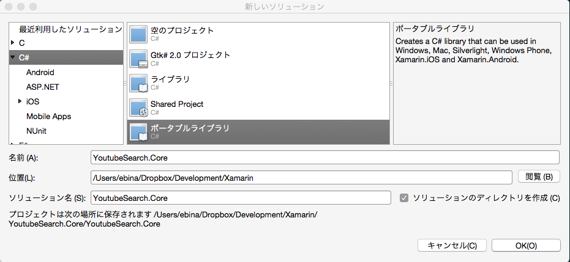

ポータブルライブラリのプロパティを開き、一般から「PCL 4.5 - Profile 111」に切り替えます。こうすることで HttpClient クラスが使用できるようになります。(Visual Studioでは作成時に確認されるので、以下のスクリーンショットの構成を選択してください)

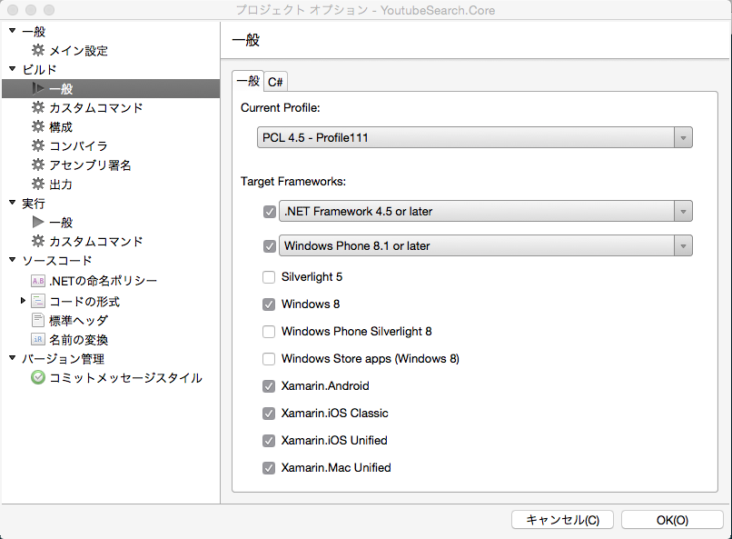

プロジェクトの追加で、Android と iOS のプロジェクトを追加します。

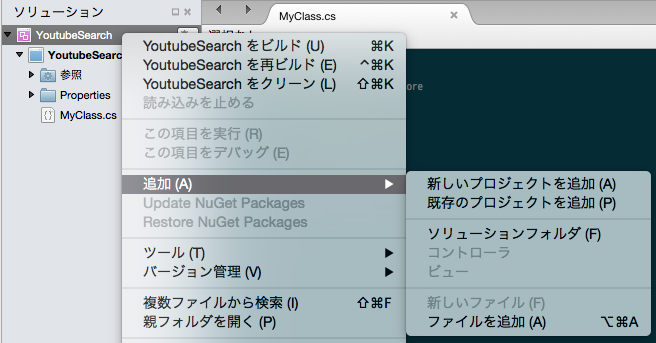

- Android
    - プロジェクトの種類: C# > Android > Android Application
    - プロジェクト名: YoutubeSearch.Droid
- iOS
     - プロジェクトの種類: C# > iOS > Unified API > iPhone > 空のプロジェクト
    - プロジェクト名: YoutubeSearch.Touch

Android のプロジェクトはデフォルトでは最新の OS にしかインストールできない状態となっているため調整が必要です。Android プロジェクトのプロパティを開き、一般のターゲットフレームワークを調整します。

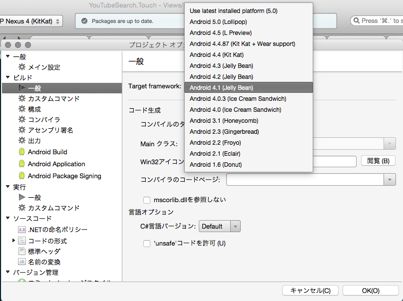

MvvmCross を追加します。プロジェクトを右クリックして追加から Add NuGet Packages を選択します。

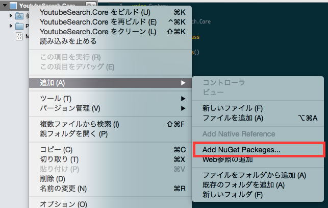

MvvmCross を検索して追加します。(古い資料には Hot Tuna Starter Pack を選択するというものがありましたが、現在はこちらを選択します。)

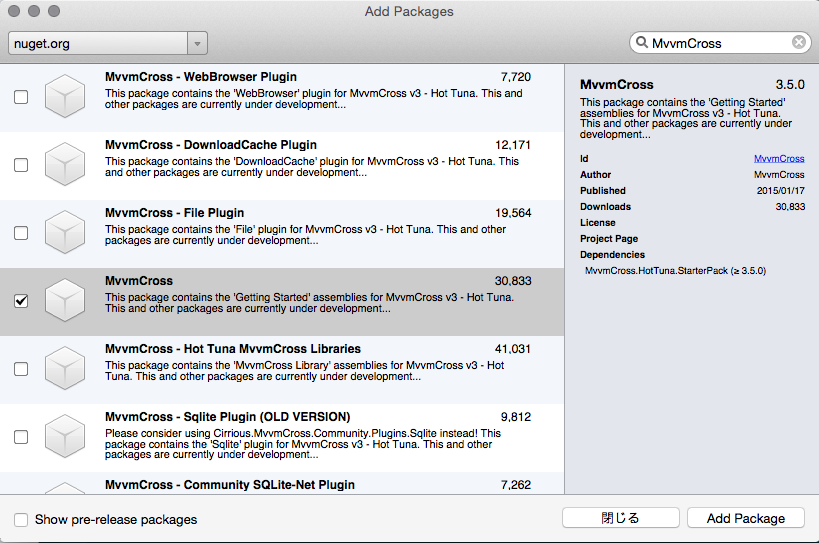

MvvmCross を追加したことによって、不要となった各プロジェクトのファイルを削除します。

- Core プロジェクトから Class1.cs を削除します。
- iOS のプロジェクトから AppDelegate.cs を削除し、MvvmCross によって追加された AppDelegate.cs.txt の拡張子 .txt を消します。
- Android のプロジェクトから MainActivity.cs と Resources/layout/Main.axml を削除します。

Android / iOS のプロジェクトから Core プロジェクトを参照します。各プロジェクトの参照フォルダをダブルクリックし、プロジェクトタブから Core プロジェクトにチェックを入れます。

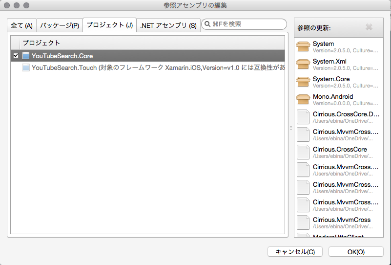

ここまでで MvvmCross プロジェクトの初期セットアップは完了です。実行すると MvvmCross のサンプルアプリが起動します。

# Step.2 検索用のプロパティを作る

Core プロジェクトの FirstViewModel.cs を開き、以下のように編集します。

SearchWord プロパティは検索キーワードのテキストボックスと、DoSearchCommand はボタンクリック時のイベントとしてそれぞれバインディングされます。

Mvx クラスは MvvmCross の各種機能を呼び出す起点となるクラスで、IoC コンテナなどはこのクラス経由で利用できます。今回はデバッグ出力の Trace メソッドを使用して動作を確認します。

```
using Cirrious.MvvmCross.ViewModels;
using Cirrious.CrossCore;

namespace YouTubeSearch.Core.ViewModels
{
    public class FirstViewModel 
		: MvxViewModel
    {
        public string SearchWord
        {
            get { return _searchWord; }
            set
            {
                _searchWord = value;
                RaisePropertyChanged(() => SearchWord);
            }
        }
        string _searchWord;

        public MvxCommand DoSearchCommand
        {
            get
            {
                return _doSearchCommand ?? (_doSearchCommand = new MvxCommand(() => {
                    Mvx.Trace("SearchTapped: {0}", SearchWord);
                }));
            }
        }
        MvxCommand _doSearchCommand;
}
```

このとき、Xamarin Studio では以下のような機能が使えるので合わせて確認すると良いでしょう。

- prop と入力して Tab キーを 2 回押すとプロパティのスケルトンが作成される
- プロパティ名で option(Alt)+Enter を入力するとメニューが現れ、「プロパティによって公開されるprivateなフィールドを作成」を押すとプライベートフィールドが生成される。

# Step.3 Android の検索 UI を作る

Main.axml を開き、デザイナ上から既存のオブジェクトをすべて削除します。

LinearLayout (Horizontal) を配置し、その中に Plain Text (EditText) と Button を配置します。(ツールボックスの検索機能を併用すると簡単です)

ボタンをダブルクリックしてキャプションに Search と入力します。このときに Tab キーを押すとリソース名を入力してテキストリソースを作成することができます。Android の開発では文字列はなるべく String.xml に分離し、リソースから取得するようにしますので、定義した方が良いでしょう。

Plain Text を選択し、プロパテウィンドウの Layout タブから LinearLayout の Weight というプロパティを探し、1 をセットします。

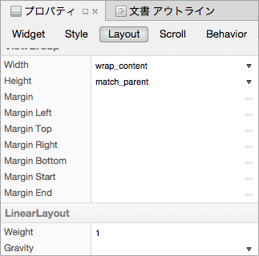

次に、追加した LinearLayout の下に ListView を置きます。ここまでで画面は以下のようになります。

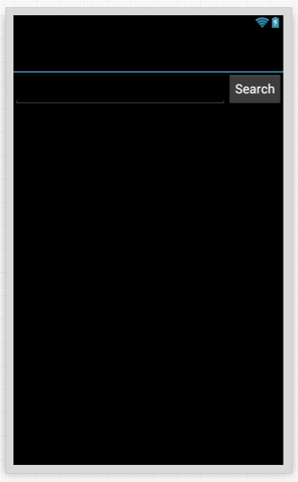

ソースタブに切り替え、以下の部分を編集します。

- android:id 属性は MvvmCross を使った場合は使わないことが多いため、作成したときに一度全部消しておきます(必要なときに追加します)。
- ListView を Mvx.MvxListView に変更します。MvvmCross が提供するバインディングできるリストビューに切り替わります。
- バインディング(local:MvxBind 属性)を記述していきます。
    - 検索フィールド：```local:MvxBind="Text SearchWord" ```
    - 検索ボタン：```local:MvxBind="Click DoSearchCommand"```
- EditText はデフォルトで改行の入力を受け付けるため、改行が入力されないようにに ```android:inputType="text"``` をつけます。

ここまでで Android プロジェクトを実行して動作を確認できますが、まだ iOS のほうはビルドエラーとなってしまうため、一度アンロードしてから実行します。

実行すると、入力フィールドにテキストを入力して Search ボタンをタップするとデバッグ出力に入力したテキストが出力されます。

確認できたら iOS のプロジェクトを再度ロードしておきます。

# Step.4 iOS の検索 UI を作る

iOS プロジェクトの FirstView.cs を開き、以下のように編集します。(量が多いのでコピーした方が良いと思います)

この ViewDidLoad メソッドは 以下のような実装になっています。

- テキストフィールド、ボタン、TableView を生成する。
- AutoLayout で画面上の View のレイアウト制約を追加する。
    - テキストフィールドは、上辺は画面の上から 10pt、左辺は画面の左から 10pt、右辺はボタンの左辺から 10pt
    - ボタンの左辺は定義済み、縦方向の中央位置をボタンと合わせ、右辺は画面の右から 10pt
    - TableViewは、上辺はテキストフィールドの下辺と 10pt、左辺、右辺、下辺は画面と合わせる
- バインディングセットを生成し、以下のようにバインディング
    - 検索フィールドを SearchWord プロパティにバインディング
    - ボタンタップを DoSearchCommand にバインディング

```
using Cirrious.MvvmCross.Binding.BindingContext;
using Cirrious.MvvmCross.Touch.Views;
using CoreGraphics;
using Foundation;
using ObjCRuntime;
using UIKit;
using Cirrious.MvvmCross.Binding.Touch.Views;

namespace YouTubeSearch.Touch.Views
{
    [Register("FirstView")]
    public class FirstView : MvxViewController
    {
        public override void ViewDidLoad()
        {
            View = new UIView { BackgroundColor = UIColor.White };
            base.ViewDidLoad();

			// ios7 layout
            if (RespondsToSelector(new Selector("edgesForExtendedLayout")))
            {
               EdgesForExtendedLayout = UIRectEdge.None;
            }

            var searchField = new UITextField(CGRect.Empty)
            {
                TranslatesAutoresizingMaskIntoConstraints = false,
                BorderStyle = UITextBorderStyle.RoundedRect
            };
            View.Add(searchField);
            var searchButton = new UIButton(UIButtonType.System)
            {
                TranslatesAutoresizingMaskIntoConstraints = false,
            };
            searchButton.SetTitle("Search", UIControlState.Normal);
            searchButton.SetContentHuggingPriority(250, UILayoutConstraintAxis.Horizontal);
            View.Add(searchButton);
            var tableView = new UITableView(CGRect.Empty)
            {
                TranslatesAutoresizingMaskIntoConstraints = false
            };
            View.Add(tableView);

            View.AddConstraints(new []
                {
                    NSLayoutConstraint.Create(searchField, NSLayoutAttribute.Top, NSLayoutRelation.Equal, 
                        TopLayoutGuide, NSLayoutAttribute.Bottom, 1.0f, 10),
                    NSLayoutConstraint.Create(searchField, NSLayoutAttribute.Left, NSLayoutRelation.Equal, 
                        View, NSLayoutAttribute.Left, 1.0f, 10),
                    NSLayoutConstraint.Create(searchField, NSLayoutAttribute.Right, NSLayoutRelation.Equal, 
                        searchButton, NSLayoutAttribute.Left, 1.0f, -10),

                    NSLayoutConstraint.Create(searchButton, NSLayoutAttribute.CenterY, NSLayoutRelation.Equal, 
                        searchField, NSLayoutAttribute.CenterY, 1.0f, 0),
                    NSLayoutConstraint.Create(searchButton, NSLayoutAttribute.Right, NSLayoutRelation.Equal, 
                        View, NSLayoutAttribute.Right, 1.0f, -10),

                    NSLayoutConstraint.Create(tableView, NSLayoutAttribute.Top, NSLayoutRelation.Equal, 
                        searchField, NSLayoutAttribute.Bottom, 1.0f, 10),
                    NSLayoutConstraint.Create(tableView, NSLayoutAttribute.Left, NSLayoutRelation.Equal, 
                        View, NSLayoutAttribute.Left, 1.0f, 0),
                    NSLayoutConstraint.Create(tableView, NSLayoutAttribute.Right, NSLayoutRelation.Equal, 
                        View, NSLayoutAttribute.Right, 1.0f, 0),
                    NSLayoutConstraint.Create(tableView, NSLayoutAttribute.Bottom, NSLayoutRelation.Equal, 
                        View, NSLayoutAttribute.Bottom, 1.0f, 0),
                });

            var set = this.CreateBindingSet<FirstView, Core.ViewModels.FirstViewModel>();
            set.Bind(searchField).To(vm => vm.SearchWord);
            set.Bind(searchButton).To(vm => vm.DoSearchCommand);
            set.Apply();
        }
    }
}
```

実行すると、先ほどの Android のものと同様の動作をします。

# Step.5 検索処理を追加する

まず、すべてのプロジェクトに対して NuGet で ModernHttpClient を追加します。ModernHttpClient は HttpClient クラスの内部処理をネイティブのライブラリで処理してくれるメッセージハンドラが入っており、通信処理を高速化することができます(iOS では NSURLSession を、Android では OkHttp を使用しています)。また、Mono の .NET 系の HTTP 通信は現状 Android で不安定な場合があるため、その対策も兼ねています。

Core プロジェクトに YouTubeFeeds.cs を作成し、以下の通り編集します。(量が多いのでコピーした方が良いと思います)

```
using System;
using System.Linq;
using System.Net.Http;
using System.Threading.Tasks;
using System.Xml.Linq;
using ModernHttpClient;
using System.Collections.Generic;

namespace YouTubeSearch.Core
{
    public static class YouTubeFeeds
    {
        public static async Task<List<YouTubeFeed>> Search(string keyword)
        {
            var httpClient = new HttpClient(new NativeMessageHandler());

            var xmlString = await httpClient.GetStringAsync(new Uri("http://gdata.youtube.com/feeds/api/videos?orderby=updated&vq=" + Uri.EscapeDataString(keyword)));

            var ns = (XNamespace)"http://www.w3.org/2005/Atom";
            var mediaNs = (XNamespace)"http://search.yahoo.com/mrss/";
            var doc = XDocument.Parse(xmlString);

            return doc.Descendants(ns + "entry")
                .Select(x => new YouTubeFeed
                {
                    Id = x.Descendants(ns + "id").First().Value,
                    Title = x.Descendants(ns + "title").First().Value,
                    Content = x.Descendants(ns + "content").First().Value,
                    Url = x.Descendants(ns + "link").Where(l =>
                        { 
                            var rel = l.Attribute("rel"); 
                            return rel != null && rel.Value == "alternate"; 
                        })
                        .Select(l => l.Attribute("href").Value).FirstOrDefault(),
                    Thumbnails = x.Descendants(mediaNs + "thumbnail").Select(t => new YouTubeThumbnail
                        {
                            Url = t.Attribute("url").Value,
                            Height = int.Parse(t.Attribute("height").Value),
                            Width = int.Parse(t.Attribute("width").Value)
                        }).ToList()
                })
                .ToList();
        }
    }

    public class YouTubeFeed 
    {
        public string Id { get; set; }
        public string Title { get; set; }
        public string Content { get; set; }
        public string Url { get; set; }
        public List<YouTubeThumbnail> Thumbnails { get; set; }

        public YouTubeThumbnail LargeThumbnail
        {
            get
            {
                return _largeThumbnail ?? (_largeThumbnail = Thumbnails.OrderByDescending(t => t.Height).First());
            }
        }
        YouTubeThumbnail _largeThumbnail;

        public YouTubeThumbnail SmallThumbnail
        {
            get
            {
                return _smallThumbnail ?? (_smallThumbnail = Thumbnails.OrderBy(t => t.Height).First());
            }
        }
        YouTubeThumbnail _smallThumbnail;
    }

    public class YouTubeThumbnail 
    {
        public string Url { get; set; }
        public int Height { get; set; }
        public int Width { get; set; }
    }
}
```

FirstViewModel に SearchResults プロパティを追加します。

    public List<YouTubeFeed> SearchResults
    {
        get { return _searchResults;
        }
        set
        {
            _searchResults = value;
            RaisePropertyChanged(() => SearchResults);
        }
    }
    List<YouTubeFeed> _searchResults;

DoSearchCommand の Mvx.Trace の呼び出しを実際の検索処理に置き換えます。

    public MvxCommand DoSearchCommand
    {
        get
        {
            return _doSearchCommand ?? (_doSearchCommand = new MvxCommand(async () => {
                SearchResults = await YouTubeFeeds.Search(SearchWord);
            }));
        }
    }
    MvxCommand _doSearchCommand;

# Step.6 Android の検索結果の表示を作る

Android プロジェクトの Resources/layout フォルダを右クリックし、[追加]メニュー、[新しいファイル]を選択します。開いた[新しいファイル]ウィンドウで [Android] の [Layout] を選択し、名前を item_search_result とします。

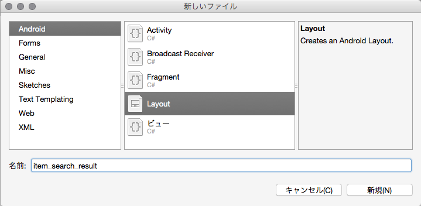

デザイナが開いたら、ツールボックスウィンドウから ImageView を選択し、画面にドロップします。

次に画面中央をクリックしてルートの LinearLayout を選択状態にし、以下のプロパティを変更します。

- Widget タブの Orientation を horizontal に変更する。
- Layout タブの ViewGroup セクションにある Height を wrap_content に変更する。

ImageView を再度選択し、以下のプロパティを変更します。

- Widget タブの Scale Type を fitCenter に変更する。
- Layout タブの ViewGroup セクションにある Width を直接編集で 120dp と入力する
- Layout タブの ViewGroup セクションにある Height を直接編集で 90dp と入力する

ツールボックスウィンドウから LinearLayout (Vertical) を選択し、ImageView の隣にドロップします。

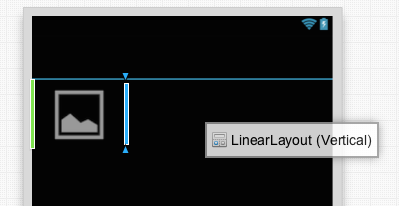

追加直後の選択状態のまま、以下のプロパティを変更します。(選択が外れて選択できなくなった場合は、[文章アウトライン]ペインを開いて、項目から選択します)

- Layout タブの ViewGroup セクションにある Width を match_parent に変更する
- Layout タブの ViewGroup セクションにある Height を wrap_content に変更する
- Layout タブの Padding を直接編集で 10dp と入力する

追加した LinearLayout (Vertical) に TextView と TextView (Small) をドロップします。

ソースモードに切り替え、以下の部分を編集します。

- android:id 属性は MvvmCross を使った場合は使わないことが多いため、作成したときに一度全部消しておきます(必要なときに追加します)。
- ルート要素の xmlns:local を、FirstView.axml からコピーしてきます。
- ImageView タグを Mvx.MvxImageView タグに変更します。この MvxImageView クラスは ImageUrl プロパティに URL をバンディングすると自動的に読み込んでくれます。
- 以下の通り、バインディングを記述していきます
    - Mvx.MvxImageView に ```local:MvxBind="ImageUrl LargeThumbnail.Url"```
    - TextView (先に追加した、無印の方) に ```local:MvxBind="Text Title"```
    - TextView (Small) に ```local:MvxBind="Text Content"```

次に、FirstView.axml を開きソースタブに切り替えます。Mvx.MvxListView に SearchResult へのバインディングと、項目を表示する際のテンプレートとなるレイアウトの指示を追加します。
- Mvx.MvxListView に以下の属性を追加します。
    - ```local:MvxBind="ItemsSource SearchResults"```
    - ```local:MvxItemTemplate="@layout/item_search_result"```

ここまでで実行すると、リストは表示されるものの画像が表示されません。MvxImageView は DownloadCache プラグインと File プラグインに依存しているため、これらがないと正しく動作することができないからです。

すべてのプロジェクトに対して NuGet から MvvmCross DownloadCache Plugin と MvvmCross File Plugin を追加します。

この状態で実行すると、検索キーワードを入力して検索ボタンをタップすると検索結果が表示されるようになります。

# Step.7 iOS の検索結果を表示する

> ※この操作には Mac / Xcode が必要となります。Windows を使用している方は SearchTableViewCell を新規作成で追加した後、SearchResultTableViewCell.xib をサンプルからコピーしてください。

iOS プロジェクトの Resources/layout フォルダを右クリックし、[追加]メニュー、[新しいファイル]を選択します。開いた[新しいファイル]ウィンドウで iOS の iPhone Table View を選択し [Android] の [Layout] を選択し、名前を SearchResultTableViewCell とします。

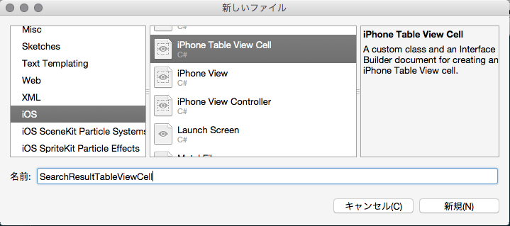

SearchTableViewCell.xib をダブルクリックして Xcode を開きます。

Table View Cell 自体を選択し、Size Inspector (右側の Utilities ペイン 左から 5 つめのタブ)を開き、Row Height を 91 と入力、Height も 91 と入力します。

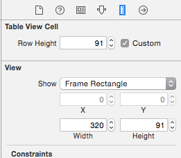

Object library (右側の Utilities ペイン 下側のタブで左から 3 つめのタブ) から ImageView を選択し、セルの中に追加します。セル全体に配置されるので、左に寄せて幅を少し狭めます。

次に、Label を 2 つ追加します。

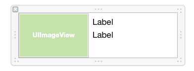

ImageView を選択し、Identity Inspector (右側の Utilities ペイン 左から 3 つめのタブ)を開き、Class に MvxImageView と入力します。

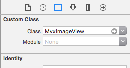

上側の Label を選択し、Attributes inspector (右側の Utilities ペイン 左から 4 つめのタブ)を開き、以下の設定を変更します。

- Font の横のボタンをクリックして、ポップアップの Font から Text Styles から Subhead を選択します。

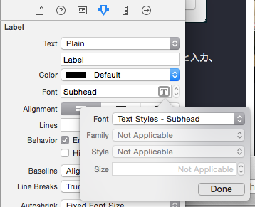

下側の Label を選択し、Attributes inspector (右側の Utilities ペイン 左から 4 つめのタブ)を開き、以下の設定を変更します。

- Font の横のボタンをクリックして、ポップアップの Font から Text Styles から Caption 2 を選択します。
- Lines を 3 とします。

Storyboard エディタ左側下にある Document Outline ボタンをクリックして開き、Mvx Image View を control キーを押しながらドラッグし親の Content View にドロップします。定義追加のウィンドウが開きます。

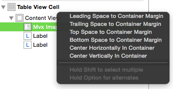

option キーと shift キーを押しながら Leading Space to Contaner、Top Space to Container、Bottom Space to Container を選択し、return キーを押します。

Mvx Image View を control キーを押しながらドラッグし、Mvx Image View 自信にドロップし、定義追加のウィンドウで Width をクリックします。追加された Width の線をダブルクリックし、ポップアップの Constant を 120 とします。

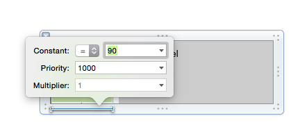

再度 Mvx Image View を control キーを押しながらドラッグし、Mvx Image View 自信にドロップし、定義追加のウィンドウで Height をクリックします。追加された Height の線をダブルクリックし、ポップアップの Constant を 90 とします。

次に、デザイナ上の上側のラベルから以下のように定義を追加していきます。

- control キーを押しながらドラッグし、MvxImageView にドロップし、Horizontal Space を選択します。
    - 追加された線をダブルクリックし、ポップアップの Constant を 10 とします。
- control キーを押しながらドラッグし、ラベル上側の何もないところにドロップし、option キーを押しながら Top Space to Container を選択します。
    - 追加された線をダブルクリックし、ポップアップの Constant を 10 とします。
- control キーを押しながらドラッグし、ラベル右側の何もないところにドロップし、option キーを押しながら Trailing Space to Container を選択します。
    - 追加された線をダブルクリックし、ポップアップの Constant を 10 とします。
- control キーを押しながらドラッグし、下側のラベルにドロップし、Vertical Spacing を選択します。
    - 追加された線をダブルクリックし、ポップアップの Constant を 10 とします。

デザイナ上の下側のラベルからは以下のように定義していきます。

- control キーを押しながらドラッグし、MvxImageView にドロップし、Horizontal Space を選択します。
    - 追加された線をダブルクリックし、ポップアップの Constant を 10 とします。
- control キーを押しながらドラッグし、ラベル右側の何もないところにドロップし、option キーを押しながら Trailing Space to Container を選択します。
    - 追加された線をダブルクリックし、ポップアップの Constant を 10 とします。
- control キーを押しながらドラッグし、ラベル下側の何もないところにドロップし、option キーを押しながら Bottom Space to Container を選択します。
    - 追加された線をダブルクリックし、ポップアップの Constant を ≧ 10 とします。(ここだけ少し指定が違います！) 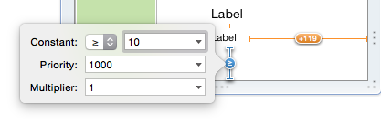

すべて定義が終わったら Storyboard エディタ右下の左から 3 つめのボタン(Resolve Auto Layout Issues)をクリックし、All Views in ... のセクションから Update Frames をクリックします。

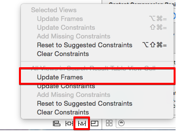

Autolayout に従って View の位置が再計算されて表示されます。


Xcode 右上のボタンのうち、左側のセクション 2 つめの 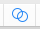 ボタン (Assistant Editor)をクリックし、Assistant Editor 開きます。Table View Cell 上の項目を選択すると SearchResultTableViewCell.m が開きますので、ファイル名の部分をクリックして、SearchResultTableViewCell.h に切り替えます。

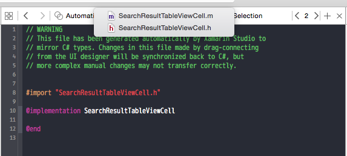

- アウトレット設定
    - ThumbnailImageView
    - TitleLabel
    - ContentLabel　

Storyoboard から View のプロパティ定義を追加していきます。

- MvxImageView からcontrol キーを押しながらドラッグし、SearchResultTableViewCell.h にドロップ Outlet の ThumbnailImageView として追加
- 上側のラベル からcontrol キーを押しながらドラッグし、SearchResultTableViewCell.h にドロップ Outlet の TitleLabel として追加
- 下側のラベル からcontrol キーを押しながらドラッグし、SearchResultTableViewCell.h にドロップ Outlet の ContentLabel として追加

Storyoboard エディタと SearchResultTableViewCell.h を Command-S を押して保存します(必ず押すこと！)、Xcode を閉じるとSearchResultTableViewCell.designer.cs にプロパティが定義されます。

次に、SearchResultTableViewCell.cs を開き、以下のように編集します。

- 基底クラスを MvxTableViewCell に変更。
- ```using Cirrious.MvvmCross.Binding.BindingContext;``` 追加
- コンストラクタにバインディングを追加。後から生成される画面コントロールの場合は DelayBind を使用します。

```
using System;

using Foundation;
using UIKit;
using Cirrious.MvvmCross.Binding.Touch.Views;
using Cirrious.MvvmCross.Binding.BindingContext;

namespace YouTubeSearch.Touch.Views
{
    public partial class SearchResultTableViewCell : MvxTableViewCell
    {
        public static readonly UINib Nib = UINib.FromName("SearchResultTableViewCell", NSBundle.MainBundle);
        public static readonly NSString Key = new NSString("SearchResultTableViewCell");

        public SearchResultTableViewCell(IntPtr handle)
            : base(handle)
        {
            this.DelayBind(() =>
                {
                    var set = this.CreateBindingSet<MvxTableViewCell, Core.YouTubeFeed>();
                    set.Bind(ThumbnailImageView).To(vm => vm.LargeThumbnail.Url);
                    set.Bind(TitleLabel).To(vm => vm.Title);
                    set.Bind(ContentLabel).To(vm => vm.Content);
                    set.Apply();
                });
        }

        public static SearchResultTableViewCell Create()
        {
            return (SearchResultTableViewCell)Nib.Instantiate(null, null)[0];
        }
    }
}
```

FirstView.cs を開き、以下のように編集します。

- CreateBindingSet の行の上に、TableViewSource を作るコードを追加する。

      var source = new MvxSimpleTableViewSource(tableView, 
          SearchResultTableViewCell.Key.ToString(), SearchResultTableViewCell.Key.ToString());
      tableView.Source = source;

- CreateBindingSet から Apply の間に、TableViewSource と SearchResults をバインディングするコードを追加する。

      set.Bind(source).For(v => v.ItemsSource).To(vm => vm.SearchResults);

これで実行すると、Android と同様の動作をします。

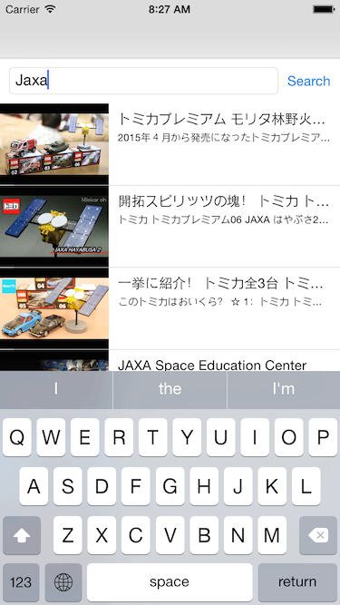

# Step.9 項目選択時に YouTube を開くようにする

項目を選択したときに、標準のブラウザで YouTube が開くようにします。WebBrowser が開く操作は MvvmCross プラグインで提供されており、Core にコードを足すのみで両 OS の実装をすることができます。

すべてのプロジェクトに対して NuGet から MvvmCross WebBrowser Plugin を追加します。

Core プロジェクトの FirstViewModel.cs を開き、以下のようにコンストラクタを追加します。

MvvmCross プラグインの多くは公開しているプラグインのオブジェクトを IoC コンテナに追加します。IoC コンテナ内にあるオブジェクトはコンストラクタの引数とすることで生成時に受け取ることができます。コンストラクタで受け取ったオブジェクトをプロパティやフィールドに保持しておきます。(これ以外の方法は、Qiita の記事 http://qiita.com/iseebi/items/11d91766f6520a7aaaf6 を参考にしてください)

    readonly IMvxWebBrowserTask _webBrowserTask;

    public FirstViewModel(IMvxWebBrowserTask webBrowserTask)
    {
        this._webBrowserTask = webBrowserTask;
    }

次に、IMvxWebBrowserTask を使用して、リストで選択された項目を開くようにするコマンドを追加します。

    public MvxCommand<YouTubeFeed> FeedSelectCommand
    {
        get
        {
            return _feedSelectCommand ?? (_feedSelectCommand = new MvxCommand<YouTubeFeed>(
                    feed => _webBrowserTask.ShowWebPage(feed.Url)));
        }
    }
    MvxCommand<YouTubeFeed> _feedSelectCommand;

Android の Resources/layout/FirstView.axml の Mvx.MvxListView の local:MvxBind 属性を以下のように変更します。ItemClick というプロパティに FeedSelectCommand をバインディングしています。

    local:MvxBind="ItemsSource SearchResults; ItemClick FeedSelectCommand"

次に、iOS は FirstView.cs の CreateBindingSet から Apply の間に、以下のコードを追加します。TableViewSource.SelectonChangedCommand と FeedSelectCommand をバインディングします。

    set.Bind(source).For(v => v.SelectionChangedCommand).To(vm => vm.FeedSelectCommand);

これで実行すると、両 OS とも項目選択時にブラウザが起動します。

# Step.10 Android で検索時に SIP が閉じるようにする

今の実装では検索結果を見ているときも SIP パネルが表示されたままで、一覧をすぐに見ることができません。特に iPhone アプリの方はキーボードを消すことができないため、領域がかなり狭くなってしまいます。そこで検索ボタンをタップした際に、キーボードを閉じるようにします。

まず、Android プロジェクトの Resources/layout/FirstView.axml を開き、EditText と Button に ID をつけます。これでコードからこれらのコントロールを参照することができます。

- EditText : ```android:id="@+id/edittext_search"```
- Button : ```android:id="@+id/button_search"```

次に、FirstView.cs を開き、OnCreate メソッドを以下のように編集します。

    protected override void OnCreate(Bundle bundle)
    {
        base.OnCreate(bundle);
        SetContentView(Resource.Layout.FirstView);
        var textField = FindViewById<EditText>(Resource.Id.edittext_search);
        var button = FindViewById<Button>(Resource.Id.button_search);
        button.Click += (sender, e) => {
            var imm = (InputMethodManager)GetSystemService(Context.InputMethodService);
            imm.HideSoftInputFromWindow(textField.WindowToken, 0);
        };
    }

まず、FindViewId メソッドで View に配置されたオブジェクトを取得し、検索ボタンのクリックイベントで InputMethodService を取得して SIP を閉じる HideSoftInputFromWindow を実行しています。

# Step.11 iOS で検索時に SIP が閉じるようにする

iOS では ViewDidLoad の最後に以下のコードを追加します。検索ボタンの TouchUpInside (タッチがボタンの領域内で外れた = ボタンがタップされた) イベントに検索フィールドのフォーカスを外す ResignFirstResponder メソッドを実行しています。

```searchButton.TouchUpInside += (sender, e) => searchField.ResignFirstResponder();```

