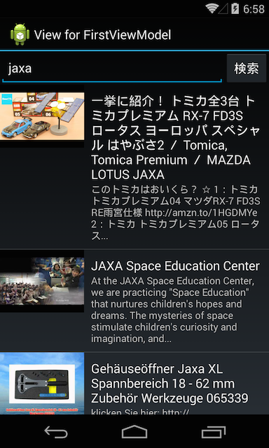

YouTubeSearch
------

MvvmCross のチュートリアルです。[Japan Xamarin User Group Conference #4](http://jxug.connpass.com/event/12544/) の ハンズオントラックのために作られました。

この実習では以下のような内容をカバーしています。

- プロジェクトセットアップ
- プロパティとコマンドの作り方
- ListView/TableViewを使う
- 画像を表示する (MvxImageView)
- MvvmCrossプラグインの使い方 (WebBrowser プラグイン)

実習の手順は [ハンドアウト](Handout/article.md) を参照してください。

